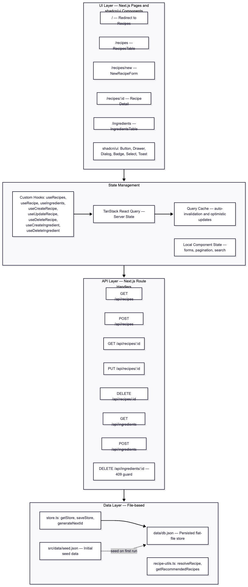
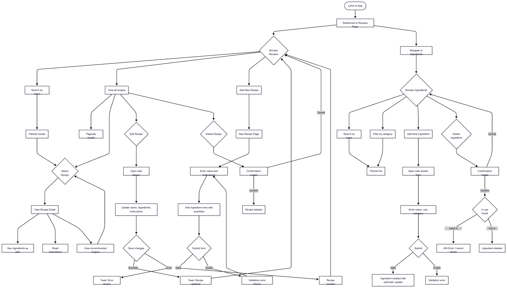

# Recipe App

A recipe app built with Next.js. It allows users to manage a library of recipes and ingredients — creating, editing, deleting, searching, filtering, and discovering new recipes through a built-in recommendation engine.

---

## Table of Contents

- [Getting Started](#getting-started)
- [Features](#features)
- [Architecture Overview](#architecture-overview)
- [System Design Diagram](#system-design-diagram)
- [User Journey Flow](#user-journey-flow)
- [Project Structure](#project-structure)
- [API Reference](#api-reference)
- [State Management](#state-management)
- [Unit and Integration Tests — Jest](#unit-and-integration-tests--jest)
- [End-to-End Tests — Playwright](#end-to-end-tests--playwright)
- [Design Decisions](#design-decisions)
- [Assumptions](#assumptions)
- [Experience](#experience)
- [Use of AI](#use-of-ai)
- [Nice to haves that were not implemented](#nice-to-haves-that-were-not-implemented)

---

## Getting Started

Install dependencies and run the development server:

```bash
pnpm install
pnpm dev
```

Open [http://localhost:3000](http://localhost:3000) in your browser. The app redirects to `/recipes` on load.

### Running Tests

```bash
# Unit & integration tests (Jest)
pnpm test             # Run all tests once
pnpm test:watch       # Watch mode — re-runs on file changes
pnpm test:coverage    # Run with coverage report

# End-to-end tests (Playwright)
pnpm test:e2e         # Run all E2E tests headlessly
pnpm test:e2e:ui      # Open Playwright interactive UI
pnpm test:e2e:report  # View the last HTML test report
```

---

## Features

### Recipes

- **List & Search** — View all recipes in a paginated table with search by name.
- **Create** — Add a new recipe with a name, instructions, and one or more ingredients (each with a quantity).
- **Edit** — Modify any recipe's name, ingredients, or instructions from a non-intrusive side drawer — no page navigation required.
- **Delete** — Remove recipes via a confirmation modal to prevent accidental deletion.
- **Detail View** — View a recipe's full details including ingredients and instructions
- **Recommendations** — On the recipe detail page, the app suggests other recipes that share the most ingredients with the current one.
- **Featured Recipe** — The recipes page highlights the latest recipe in a banner, giving it visual prominence and a quick link to its detail page.

### Ingredients

- **List & Search** — View all ingredients in a paginated table with search and category-based filtering.
- **Create** — Add ingredients with a name, unit (e.g. "grams", "cups"), and category (e.g. "produce", "dairy").
- **Delete with Guard** — Attempting to delete an ingredient that is referenced by one or more existing recipes returns an error. This prevents dangling data and broken recipe integrity.
- **Optimistic Updates** — When adding an ingredient, the UI updates instantly before the server confirms — making the experience feel immediate and snappy.
- **Recipe Finder** — Select one or more ingredients from the list and a side panel instantly shows which recipes you can make with them. Each result highlights which of the recipe's ingredients you have selected. Recipes where every ingredient is selected are promoted with a filled badge so they stand out.

### General

- **Validation** — Forms validate on both the client (before submission) and server (in the API handler), ensuring data integrity at every boundary.
- **Toast notifications** — Success and error feedback delivered via Sonner toasts without interrupting the user's flow.
- **Responsive design** — Mobile-first layout using Tailwind CSS and shadcn/ui components, adapting cleanly across phone, tablet, and desktop viewports.
- **Light & Dark theme** — Toggle between light and dark mode via a header button or the `D` keyboard shortcut. Dark mode uses a warm slate-blue background for a refined, eye-friendly feel.
- **Emerald primary colour** — A vibrant emerald green is used as the primary colour across both themes, giving buttons and interactive elements strong visual identity.

---

## Architecture Overview

The application is structured into four distinct layers that map cleanly onto their responsibilities. Each layer only knows about the layer directly below it, keeping concerns separated and the codebase easy to reason about.

```
UI Layer
   │  Next.js pages + shadcn/ui components
   ↓
State Management Layer
   │  TanStack React Query (server state) + local React state (UI state)
   ↓
API Layer
   │  Next.js Route Handlers (/api/recipes, /api/ingredients)
   ↓
Data Layer
   │  File-based JSON store (data/db.json) + utility functions
```

### Layer Breakdown

| Layer     | Technology                                  | Responsibility                                     |
| --------- | ------------------------------------------- | -------------------------------------------------- |
| **UI**    | Next.js App Router, shadcn/ui, Tailwind CSS | Pages, components, user interactions               |
| **State** | TanStack React Query, React `useState`      | Caching, mutations, optimistic updates, form state |
| **API**   | Next.js Route Handlers                      | REST endpoints, validation, business logic         |
| **Data**  | `data/db.json`, `store.ts`                  | Flat-file persistence, ID generation               |

---

## System Design Diagram

<details>
<summary>Click to view system design diagram</summary>



</details>

---

## User Journey Flow

The diagram below illustrates the primary paths a user can take through the application, from landing on the app through to managing recipes and ingredients.

<details>
<summary>Click to view user journey diagram</summary>



</details>

---

## Project Structure

```
src/
├── app/                        # Next.js App Router pages and API routes
│   ├── page.tsx                # Root redirect → /recipes
│   ├── layout.tsx              # Root layout (NavBar, React Query provider)
│   ├── recipes/
│   │   ├── page.tsx            # Recipes listing page
│   │   ├── [id]/page.tsx       # Recipe detail + recommendations
│   │   └── new/page.tsx        # Create new recipe page
│   ├── ingredients/
│   │   └── page.tsx            # Ingredients listing page
│   └── api/
│       ├── recipes/route.ts            # GET all, POST
│       ├── recipes/[id]/route.ts       # GET one, PUT, DELETE
│       ├── ingredients/route.ts        # GET all, POST
│       └── ingredients/[id]/route.ts   # DELETE (with 409 guard)
├── components/                 # Reusable UI components
│   ├── nav-bar.tsx
│   ├── recipes-table.tsx
│   ├── ingredients-table.tsx
│   ├── new-recipe-form.tsx
│   ├── add-ingredient-form.tsx
│   ├── edit-recipe-drawer.tsx
│   ├── recipe-finder-panel.tsx  # "What can I make?" side panel
│   ├── pagination-controls.tsx  # Shared pagination component
│   ├── recipe-ingredient-input.tsx # Shared ingredient selector + chips
│   ├── confirm-delete-dialog.tsx   # Shared delete confirmation dialog
│   └── ui/                     # shadcn/ui component primitives
├── hooks/                      # Custom React Query hooks
│   ├── use-recipes.ts
│   ├── use-ingredients.ts
│   └── use-recipe-form.ts      # Shared recipe form state & validation
├── lib/                        # Shared utilities and configuration
│   ├── types.ts                # TypeScript type definitions
│   ├── store.ts                # File-based JSON data store
│   ├── api.ts                  # Client-side API fetch functions
│   ├── recipe-utils.ts         # resolveRecipe, getRecommendedRecipes, getRecipesByIngredients
│   ├── constants.ts            # QUERY_KEYS, API_ENDPOINTS, shared UI constants
│   └── utils.ts                # cn() Tailwind class merger
└── data/
    └── mockdata.json            # Initial mock data for testing
data/
└── db.json                     # Runtime persistent store
__tests__/                      # Jest test suites
```

---

## API Reference

All endpoints follow REST conventions and return JSON. Server-side validation is applied on all write operations.

### Recipes

| Method   | Endpoint           | Description                                                       |
| -------- | ------------------ | ----------------------------------------------------------------- |
| `GET`    | `/api/recipes`     | Returns all recipes with ingredient names and units resolved      |
| `POST`   | `/api/recipes`     | Creates a new recipe. Requires `name` and at least one ingredient |
| `GET`    | `/api/recipes/:id` | Returns a single recipe with resolved ingredient details          |
| `PUT`    | `/api/recipes/:id` | Updates a recipe's name, ingredients, and/or instructions         |
| `DELETE` | `/api/recipes/:id` | Deletes a recipe by ID                                            |

### Ingredients

| Method   | Endpoint               | Description                                                                     |
| -------- | ---------------------- | ------------------------------------------------------------------------------- |
| `GET`    | `/api/ingredients`     | Returns all ingredients                                                         |
| `POST`   | `/api/ingredients`     | Creates a new ingredient. Requires `name`, `unit`, and `category`               |
| `DELETE` | `/api/ingredients/:id` | Deletes an ingredient. Returns `409 Conflict` if it is referenced by any recipe |

### Data Models

```typescript
// An individual ingredient in the store
type IngredientType = {
  id: string; // e.g. "ing1"
  name: string; // e.g. "Flour"
  unit: string; // e.g. "grams"
  category: string; // e.g. "dry goods"
};

// Links an ingredient to a recipe with a quantity
type RecipeIngredientType = {
  ingredientId: string;
  quantity: number;
};

// A recipe as stored in the data layer
type RecipeType = {
  id: string;
  name: string;
  ingredients: RecipeIngredientType[];
  instructions?: string;
};

// A recipe with ingredient names and units resolved — used in the UI
type RecipeWithIngredientsType = Omit<RecipeType, 'ingredients'> & {
  ingredients: Array<RecipeIngredientType & { name: string; unit: string }>;
};
```

---

## State Management

The app uses a hybrid state strategy: **TanStack React Query** for server state and **React `useState`** for local UI state.

### Server State — React Query

All data fetching and mutation logic lives in custom hooks under `src/hooks/`. These hooks wrap React Query's `useQuery` and `useMutation` primitives, exposing a clean and reusable interface to the rest of the UI.

```
useRecipes()          // Fetch all recipes
useRecipe(id)         // Fetch a single recipe
useIngredients()      // Fetch all ingredients

useCreateRecipe()     // POST /api/recipes — invalidates recipe list cache
useUpdateRecipe(id)   // PUT /api/recipes/:id — invalidates recipe + list
useDeleteRecipe()     // DELETE /api/recipes/:id — with confirmation + toast
useCreateIngredient() // POST /api/ingredients — with optimistic update
useDeleteIngredient() // DELETE /api/ingredients/:id — handles 409 gracefully
```

**Key behaviours:**

- **Cache invalidation** — After any mutation, the relevant query caches are automatically invalidated so the UI reflects the latest data without a manual page refresh.
- **Optimistic updates** — `useCreateIngredient` updates the local cache immediately using a temporary placeholder ID, giving instant visual feedback. The cache is later reconciled once the server response confirms the new entry.
- **Error boundaries** — All mutations catch errors and surface them as toast notifications, keeping the user informed without blocking the UI.

### Client State — React `useState`

Form input values (recipe name, selected ingredient, quantity), drawer open/close state, pagination offsets, and search filter strings are all managed with `useState` local to each component. This keeps the components self-contained and avoids polluting the global state.

## Unit and Integration Tests — Jest

| Test file                                        | Coverage                                               |
| ------------------------------------------------ | ------------------------------------------------------ |
| `__tests__/api/recipes.test.ts`                  | API route handlers (GET, POST, PUT, DELETE)            |
| `__tests__/api/ingredients.test.ts`              | API route handlers including 409 conflict guard        |
| `__tests__/components/recipes-page.test.tsx`     | Recipes listing UI, search, pagination                 |
| `__tests__/components/new-recipe-page.test.tsx`  | Recipe creation form, validation                       |
| `__tests__/components/recipe-detail.test.tsx`    | Detail view, ingredient pills, recommendations         |
| `__tests__/components/ingredients-page.test.tsx` | Ingredients listing, category filter                   |
| `__tests__/lib/recipe-utils.test.ts`             | `resolveRecipe` and `getRecommendedRecipes` unit tests |

The test setup in `__tests__/test-utils.tsx` provides a shared wrapper with the React Query `QueryClient` provider pre-configured, making it straightforward to test components that rely on query hooks without needing to mock the entire library.

## End-to-End Tests — Playwright

E2E tests live in `e2e/` and run against the real Next.js dev server using a real Chromium browser. They exercise complete user flows from the browser's perspective — navigating, filling forms, clicking buttons, and asserting on visible outcomes.

| Test file                 | What it tests                                                                                         |
| ------------------------- | ----------------------------------------------------------------------------------------------------- |
| `e2e/recipes.spec.ts`     | Redirect, listing, search, create, detail view, recommendations, edit, delete (confirm + cancel)      |
| `e2e/ingredients.spec.ts` | Listing, search, category filter, add, delete free ingredient, 409 guard on in-use ingredient, cancel |

**Data isolation:** `e2e/helpers/reset-db.ts` copies `/data/mockdata.json` back into `data/db.json` in a `beforeEach` hook before every test, ensuring a clean, predictable state regardless of what previous tests wrote.

---

## Design Decisions

### Next.js App Router

Next.js was chosen for its support for server and client components, API route handlers, and file-based routing. This lets the data-fetching logic live close to the routes that need it, keeping the project well-organised as it scales.

### Server vs. Client Components

Server components are used for layouts and initial page renders. Client components (`"use client"`) are used only where interactivity is required — forms, drawers, tables with sorting/filtering. This boundary keeps JavaScript bundle sizes smaller and initial page loads faster.

### shadcn/ui

Rather than building a component library from scratch, shadcn/ui provides a set of accessible, well-composed primitives (Button, Drawer, Dialog, Badge, Input, Select, etc.) built on Radix UI and styled with Tailwind CSS. Components are copied into the codebase under `/components/ui/`, making them fully customisable without fighting library constraints.

### TanStack React Query for Server State

React Query was chosen over alternatives like SWR or a plain `useEffect` + `fetch` approach because it offers a rich feature set out of the box: automatic background refetching, cache invalidation, optimistic updates, and structured loading/error states — all without manual boilerplate.

### TanStack Table for Data Tables

Recipes and ingredients are displayed using TanStack Table, which provides imperative column definitions, built-in sorting, filtering, and pagination hooks. This is significantly more scalable than a hand-rolled HTML table, especially as the dataset grows.

### Side Drawer for Forms

Add and edit forms open in a side drawer rather than navigating to a separate page. This keeps the user in context — they can see the recipe or ingredient list in the background, and return to it instantly after saving. It avoids unnecessary routing overhead for what is fundamentally an overlay interaction.

### Ingredient Deletion Guard (409 Conflict)

The `DELETE /api/ingredients/:id` handler checks whether the ingredient is referenced by any recipe before deleting it. If it is, the server responds with `409 Conflict`. This prevents orphaned references in recipes and protects data integrity at the API boundary — not just at the UI level.

### Ingredient Pills in Detail View

Ingredients are rendered in a grid. This provides a dense, scannable summary of what goes into a recipe without requiring the user to parse a raw list or table.

### `useRouter` vs. `next/link`

`next/link` is used for all static navigation links (e.g. the navbar). `useRouter` is reserved for programmatic navigation — e.g. redirecting after form submission or navigating based on dynamic conditions — keeping the distinction between declarative and imperative navigation clear.

### Recommendation Engine

`getRecommendedRecipes` in `/lib/recipe-utils.ts` computes recipe suggestions by counting how many ingredients a candidate recipe shares with the currently viewed recipe. Results are sorted descending by this overlap count and the top N are returned. This is a simple but effective signal for relevance.

### Recipe Finder Panel

The ingredients page includes a Recipe Finder side panel powered by `getRecipesByIngredients`. Users select ingredients from the table via checkboxes, and the panel instantly filters recipes that use any of those ingredients. Each result shows a match ratio (e.g. 3/5) so users can see at a glance how close they are to having everything they need. Fully matched recipes get a filled badge to stand out. This turns the ingredients page from a passive list into an interactive discovery tool.

### Truncated Ingredient Badges (+N more)

Recipe rows in the table display a maximum of four ingredient badges, with any overflow collapsed into a "+N more" badge. The previous design rendered every ingredient inline, which caused rows to expand unpredictably — recipes with many ingredients pushed the layout taller, created uneven row heights, and made scanning the list harder. Capping at four keeps rows visually consistent, reduces layout shift when data changes, and still gives users enough context to identify a recipe at a glance. The full ingredient list remains accessible on the recipe detail page.

### TypeScript Throughout

TypeScript is used across the entire codebase — API handlers, hooks, utilities, and components. Shared type definitions in `/lib/types.ts` ensure that the data shape flowing through each layer is consistent and that type errors are caught at compile time rather than at runtime.

### Mobile-First Responsive Design

Components are designed mobile-first using Tailwind CSS responsive utilities. On small screens, recipe cards stack vertically. On larger viewports, a multi-column grid is used. The navbar and forms are designed to work cleanly at any viewport width.

### Unsplash Hero Images

Recipe detail and creation pages use food photography from Unsplash as hero banners. Users expect a recipe app to feel visual, and the images add warmth without affecting functionality. They're loaded via `next/image` for optimised delivery.

### Horizontal Category Filters on Ingredients

The ingredients page uses a horizontal row of category pills with recipe counts on each. Users can filter by category in a single tap and get an at-a-glance inventory summary without needing dropdowns.

### Instruction Preview on Recipe List Items

Each recipe row shows a truncated line of instructions beneath the name. This lets users scan what a recipe involves without clicking through to the detail page, making the list more informative as a browsing interface.

### Light & Dark Theme Support

Light and dark themes are toggled from the header or by pressing `D`, powered by `next-themes`. The dark theme uses a warm slate-blue background instead of pure black for a softer feel. Emerald green is the primary colour, chosen for strong contrast across both themes.

---

## Assumptions

- **Ingredient deletion should be guarded at the API level.** If an ingredient is still referenced by any recipe, the server responds with `409 Conflict` rather than silently deleting it and leaving orphaned references. This felt like the right default — data integrity should be enforced at the boundary, not rely on the UI preventing the action.
- **Going beyond the minimum spec was intentional.** The brief asked for a recipes page and an ingredients page with basic CRUD. I chose to extend it with a recipe detail page, an edit drawer, recipe instructions, and a recommendation engine because these features demonstrate a more realistic product — and show how I think about user experience, not just checkbox requirements.
- **A flat JSON file is sufficient for persistence.** Given the scope of the test, a proper database would add setup friction without meaningfully improving the evaluation. The JSON file keeps the project easy to clone and run while still demonstrating the API design patterns.
- **Optimistic updates are appropriate for this kind of app.** Mutations (create, edit, delete) update the UI immediately and roll back on failure. This is a common pattern in modern apps and demonstrates understanding of React Query's cache management — but it does assume the happy path succeeds most of the time.
- **The recommendation engine can be simple.** Counting shared ingredients between recipes is naive but effective for a small dataset. A production version might weight by category, prep time, or user history — but for this test, ingredient overlap is a reasonable signal.

---

## Experience

I enjoyed working on this test. The brief was clear and open-ended enough to allow creative decisions, which made it feel more like building a real product than ticking boxes. The recipe/ingredients domain is well-suited to demonstrating full-stack patterns — CRUD, relational data, search, filtering — without the problem feeling contrived.

The parts I found most satisfying were the Recipe Finder panel (turning the ingredients table into an interactive discovery tool) and the recommendation engine (a small feature that adds genuine utility). Both went beyond what was strictly asked for, but they felt like natural extensions that a user would actually want.

If I had more time, I'd add image uploads, user accounts, and proper database persistence — but within the scope of a take-home test, I'm happy with where it landed.

---

## Use of AI

The core architecture, system design, data model, and component structure were designed independently. AI assistance was used in a targeted way:

- **Test setup** — Configuring Jest with Next.js and React Testing Library, including the initial `jest.config.ts` and `jest.setup.ts` boilerplate.
- **Complex mocking** — Mocking React Query hooks and providers in the test environment is non-trivial. AI helped navigate some of the more subtle patterns required to mock `useQuery` return values correctly.
- **Code review** — Used to review code for potential performance issues (unnecessary re-renders, missing memoisation) and edge cases that might have been overlooked.
- **React Query boilerplate** — After providing a detailed pseudo-plan of the hook structure I wanted, AI helped scaffold the initial versions of `useRecipes` and `useIngredients`, which were then reviewed and refined manually.
- **Test writing** — For test writing, I provided AI with the specific user flows and edge cases I wanted to verify — for example, CRUD operations on API route handlers and the 409 conflict when deleting an ingredient still used by a recipe. The generated drafts were then reviewed and adjusted to ensure correctness and completeness.

## Nice to haves that were not implemented

- **Image uploads** — Allowing users to upload their own photos for recipes would make the app more personal and engaging.
- **Bulk ingredient deletion** — Allowing users to select multiple ingredients and delete them in one action (with appropriate guards) would be a nice efficiency improvement for managing large ingredient lists.
- **Bookmark Recipes** — Allow users to "favourite" or bookmark recipes for quick access later.
- **User accounts** — Adding authentication and user-specific data would allow for a more personalised experience, with private recipe collections and ingredient lists.
- **Shareable links** — Allow users to share recipes via unique URLs, making it easy to share with friends or on social media.
- **Embed Video intructions** — Allow recipe instructions to include embedded videos (e.g. from YouTube) for more engaging, step-by-step guidance.
- **Generate Description by AI models** — Use AI to generate a short description or summary for each recipe based on its ingredients and instructions, giving users a quick overview when browsing the list.
- **Calories Calculator** - Integrate a calorie calculator that estimates the total calories of a recipe based on its ingredients and quantities, providing users with nutritional insights.
